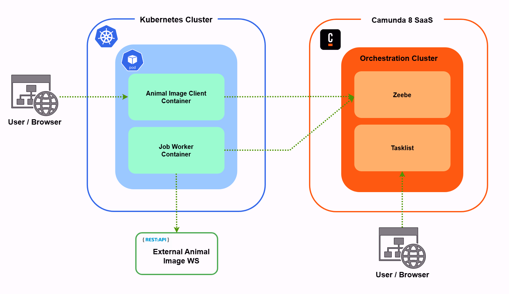
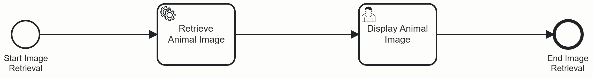

# Animal Image Retrieval

## Objective
Build a client app for Camunda 8, that gets a random image of a dog, duck or fox.
<br/><br/>

<a id="deploy_opt"></a>
## Deployment Options:

### 1. <em>Helm</em>

```sh
helm install animal-image-app animal-image-app --namespace [NAMESPACE]
```
The environment variables need to be updated in the `.env.secret` section of the `values.yaml` file. Please see further below for the [environment variables](#env_var).

Once the helm chart is deployed:\
To access the application from a host with kubernetes, run the following command:

```sh
kubectl --namespace [NAMESPACE] port-forward service/animal-image-app 5000:5000
```
The application with then be available on http://127.0.0.1:5000 on the host.

If using minikube, run the following command:

```sh
minikube service animal-image-app --url
```

The above will provide a url in the format http://127.0.0.1:[EPHEMERAL_PORT] where the [EPHEMERAL_PORT] will be output by the minikube command.
<br/><br/>

### 2. <em>Docker</em>

```sh
docker run --name animal-image-app -p 5000:5000 --env-file [ENVIRONMENT_VARIABLES_FILE_PATH] deeshal/animal-image-app:0.1
```
Please see below for the required [environment variables](#env_var).
<br/><br/>

<a id="env_var"></a>
### Required Environment Variables
The environment variables file path must contain the following items:

| Key | Value |
| - | - |
| ZEEBE_REST_ADDRESS | The address of the REST API of the SaaS cluster to connect to. |
| CAMUNDA_TOKEN_AUDIENCE | The audience for which the token should be valid. |
| CAMUNDA_CLIENT_ID | The client ID used to request an access token from the authorization server. |
| CAMUNDA_CLIENT_SECRET | The client secret used to request an access token from the authorization server. |
| CAMUNDA_OAUTH_URL | The URL of the authorization server from which the access token can be requested. |
| FLASK_SESSION_SECRET_KEY | The secret key used by Flask to secure sessions, cookies and other cryptographic operations. |
<br/>

## Solution Architecture and Design:



The `Animal Image Client` application is a web application build on Flask, the lightweight Python web framework. The application has been containerised for the purpose of running on a Kubernetes cluster. Internally, it makes requests to the `Orchestration Cluster REST API` to perform the automated actions.

### Process Flow:
Users access the application via a browser and selects an animal. This triggers a web service request to get a token from the Camunda 8 SaaS cluster (if one does not exist in the session). It then deploys the resources (a .bpmn and a .form file) for a process application to the cluster.



The client application then creates a process instance and sets an input variable (`animal`). The first step after the Start event is a Service Task (`Retrieve Animal Image`) so the job for the service task is retrieved and activated.

The client application uses the variable to make a REST API call to the relevant external service to retrieve a random image of the animal. It finally adds the image URL as an output variable and completes the job.

The output variable from the service task is passed as input variable to the `Display Animal Image` user task which display a Camunda form containing an Image View component. The image URL is then used to as the image source of the Image View component.

A user can then view the Camunda form from the tasklist and complete the process.
<br/><br/>

## Tasks Completion:

| Task | Status | Task Description | Notes
| - | - | - | - |
| 1 | ✅ | Create a process model (BPMN) | Created on Camunda 8 SaaS's web modeler. |
| 1.a | ✅ | Process model takes an input variable of an animal | N/A |
| 1.b | ✅ | Process model fetches picture of animal | N/A |
| 2 | ✅ | Build a client app | Web application built on Flask (Python web framework).  |
| 2.a | ✅ | Client app deploys the process model | Performed by calling the Orchestration Cluster REST API. |
| 2.b | ❌ | Client app has a custom REST API | Deliberate choice to not include a REST API for the client app as it would add an additional layer of complexity. This is because it would mean that the client app would expose a REST API and then also have a UI which consumes that API, which in turns consumes the Orchestration Cluster REST API. |
| 2.b.i | ✅ | Client app starts process instance with input variable | Input variable value is taken from user selection in the client app UI.
| 2.c | ✅ | Implement a Job worker | Since the client app is web-based running on the Flask development server, it does not do any polling. It performs this task by making a series of requests to the Orchestration Cluster REST API |
| 2.c.i | ✅ | Fetches the image from an API | There are 3 external APIs that can be called - one for each animal |
| 2.c.ii | ❌ | Stores the picture in a DB of your choice. | Not implemented as a result of a mixture of design decision, added complexity and lack of time. The client app also already stores the image URL on a Camunda Form so that information can be retrieved if need be. If this feature is to implement in the future, the sqlite3 Python library would store the image as a blob in an SQLite database. |
| 2.d | ❗ | Add automated tests | Limited unit tests added to this project due to time constraints. The Camunda Process Test library also is only availabe as a Java library. Reading on the Testcontainers runtime, I started creating a pytest test case to use the K3s module to automate testing of the helm chart deployment. |
| 3 | ✅ | Containerise the application | Image available in the deeshal/animal-image-app repo in Docker Hub.
| 4 | ✅ | Add a setup to make the app run locally | See [Deployment Options](#deploy_opt) above. |
| 5 | ✅ | Add README | N/A |
| 6 | ✅ | Add HELM chart for a Kubernetes Deployment | Helm chart in [helm/animal-image-app](./helm/animal-image-app/) folder. |
<br/>

## Improvements:
- Add more unit tests and investigate ways to automate all actions in the process model to enable automated tests for all possible paths.
- GitHub Actions to automate pytests, Docker image build, dry-run and push to Docker Hub.